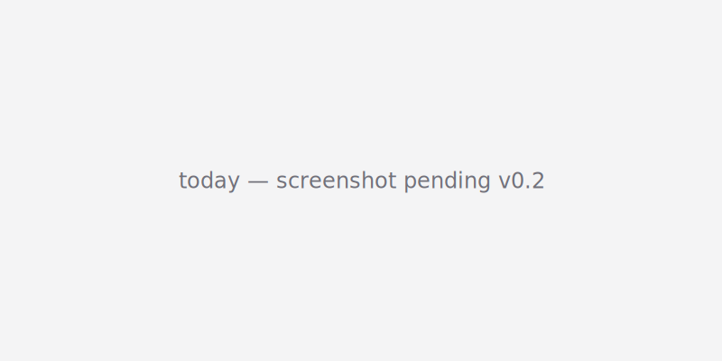
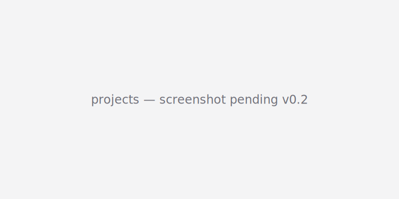
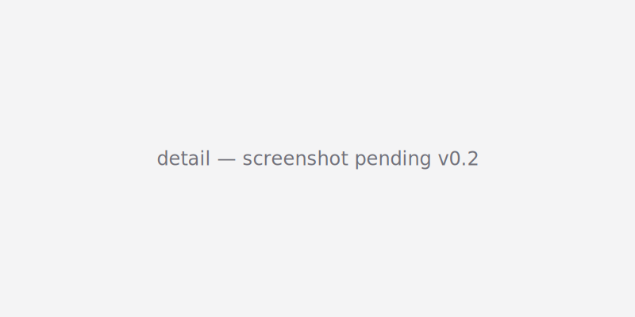
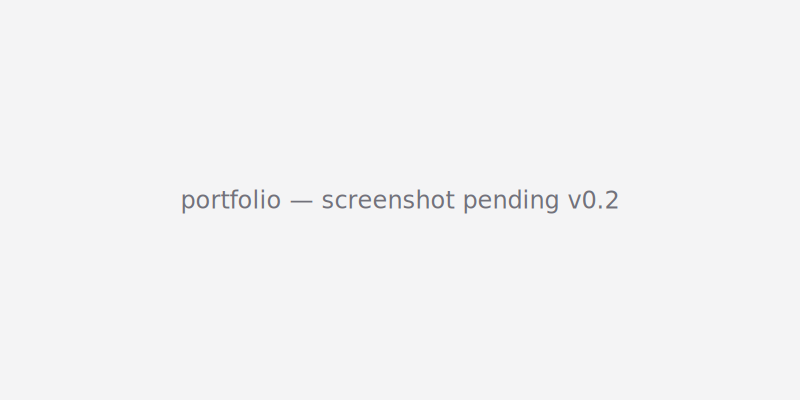

# Mast

> Portfolio strategy layer for indie developers running many app projects in parallel.

Mast sits on top of [Multica](https://github.com/multica-ai/multica) and complements it. **Multica executes** — your agent fleet picks up issues and ships code. **Mast plans** — it watches your portfolio, maintains a `STATUS.md` per project, generates a daily AI brief, and drafts the next batch of issues for you to approve into Multica.

If you have 10+ apps in flight and you're losing track of what to push today, what's gone quiet, and which shipped apps actually pay back the hours you spend on them — Mast is the missing meta-layer.

**Status:** v0.1 alpha. Functional and tested, not yet dogfooded against real data. Single-user, local-first. Not ready for production multi-user use.

---

## Screenshots

<!-- TODO(v0.2): replace placeholders with real screenshots once dogfood data lands -->

| Today | Projects |
|---|---|
|  |  |

| Project detail with draft issues | Portfolio ROI |
|---|---|
|  |  |

---

## How it fits together

```
┌────────────── Mast (this repo) ──────────────┐
│   Next.js UI ──┐                             │
│   (localhost) │                              │
│               ├──► SQLite (aggregates)       │
│   Daemon ─────┤                              │
│   (cron)      └──► STATUS.md per repo        │
└────┬──────────┬──────────┬──────────┬────────┘
     │ read     │ read     │ read     │ read + write issues
     ▼          ▼          ▼          ▼
 git logs   Claude     App Store    Multica
 (~/dev/*)  JSONL      Connect      (your fleet)
            (~/.claude RevenueCat
             /projects)
```

The flow: Mast reads git + Claude session logs + (optional) App Store / RevenueCat. It maintains a `STATUS.md` per project — you own the strategic section (intent, north-star, weekly goal); the AI overwrites the observed section daily (velocity, health score, zombie risk). Each morning a brief recommends 1-3 projects to push. You click "Draft issues" on one, AI generates 3-6 issue drafts from your STATUS.md goals, you approve, and Mast pushes them to Multica — where your agents pick them up.

---

## Prerequisites

- macOS or Linux
- Node.js 22+, pnpm 10+
- A working [Multica](https://github.com/multica-ai/multica) install with a personal access token (`mul_...`)
- Either the [Claude Code CLI](https://docs.anthropic.com/en/docs/claude-code) or [Codex CLI](https://github.com/openai/codex) on your PATH — Mast shells out to one of these for AI calls. The subscription pays for the AI, not the API.
- Optional: App Store Connect API key, RevenueCat secret key

---

## Quickstart

See [docs/QUICKSTART.md](docs/QUICKSTART.md) for a 5-minute walkthrough.

TL;DR:

```bash
git clone https://github.com/kanshao23/mast
cd mast
pnpm install
cp .env.example .env.local   # set MAST_REPOS_ROOT to your dev folder
pnpm dev          # http://localhost:3000
pnpm daemon       # in another terminal
```

Open Settings, paste your Multica token. The daemon will populate the dashboard within a couple of minutes.

---

## Architecture

See [docs/ARCHITECTURE.md](docs/ARCHITECTURE.md) for the full design rationale, data model, and data sources.

---

## Roadmap

**v0.1 (current)** — core ingest + STATUS.md + brief + issue drafting + Multica push, single-user local.

**v0.2** — App Store Connect ingestion, RevenueCat ingestion, real screenshots, polish from dogfood week.

**v0.3** — SwiftUI menubar app, Codex session log ingestion, Google Play Console support.

**Beyond** — undecided. Mast deliberately stays single-user local. If you want multi-user / cloud, fork.

---

## Contributing

See [CONTRIBUTING.md](CONTRIBUTING.md). Short version: bug reports and small fixes welcome. Big features should open a discussion first — Mast has a deliberately narrow scope.

---

## License

[Apache-2.0](LICENSE).
